# Xerina MiniAgent

## 项目简介

### 概述

Xerina MiniAgent 是一个集成了 AI 对话、多角色 Agent 工作流、多智能体辩论赛、RAG 知识库和 MCP 工具调用的全栈项目。本项目基于 **Dasi MiniAgent** 开源框架进行二次开发与深度增强，旨在探索更复杂的多智能体协同场景。

- 前端：Vue 3、Vite、TailwindCSS、Axios、Pinia、vue-router、vue-flow
- 后端：Spring Boot 3、Java 17、Spring AI、MyBatis、MySQL、PostgreSQL、Redis、Docker、OneAPI
- **核心增强：多智能体辩论赛系统、实时仲裁调度引擎、多 AI 群聊协作模式**

### 目录结构

```
.
├── backend                     # 后端工程
│   ├── ai-agent-api            # 网络接口层
│   ├── ai-agent-app            # 应用启动与配置层
│   ├── ai-agent-domain         # 服务领域层
│   ├── ai-agent-infrastructure # 基础设施层
│   ├── ai-agent-trigger        # 接口适配层
│   ├── ai-agent-types          # 公共对象层
│   ├── docs/mysql              # 数据库脚本
│   ├── docs/docker             # docker compose
│   └── pom.xml                 # Maven 聚合配置
│
├── frontend                    # 前端工程
│   ├── index.html              # 入口 HTML
│   ├── public                  # 公共静态资源
│   ├── src                     # 前端源码目录
│   │   ├── App.vue             # 根组件
│   │   ├── main.js             # 应用入口
│   │   ├── style.css           # 全局样式与主题变量
│   │   ├── assets              # 图片图标等静态素材
│   │   ├── components          # 页面与通用组件
│   │   ├── request             # 请求封装、接口方法与鉴权数据处理
│   │   ├── router              # 路由配置与 Pinia 状态管理
│   │   └── utils               # 通用工具函数
│   ├── tailwind.config.js      # TailwindCSS 配置
│   └── vite.config.js          # Vite 构建配置
│
└── mcp                         # MCP 自建服务集合
    ├── docker-build.sh         # MCP 构建脚本
    ├── start-mcp.sh            # MCP 运行脚本
    ├── mcp-server-amap         # 高德地图 MCP 服务
    ├── mcp-server-bocha        # 博查搜索 MCP 服务
    ├── mcp-server-csdn         # CSDN MCP 服务
    ├── mcp-server-email        # 邮件发送 MCP 服务
    └── mcp-server-wecom        # 企业微信 MCP 服务
```

## 核心功能

### Multi-Agent Debate & Collaboration (核心)

- **智能体辩论赛**：支持自定义辩论主题，自由分配正方/反方辩手，并设定 AI 仲裁者（主持人）进行全自动调度、过程解说及胜方裁决。
- **多智能体群聊**：在一个房间内邀请多个不同能力的 AI 智能体与用户共同交流，支持 @ 指定智能体响应，模拟真实的多人协作场景。
- **实时调度系统**：基于仲裁者指令或预设规则（轮询/权重/随机）的发言权分配机制，确保对话流的逻辑性与平衡性。

### Chat Client

- **对话增强**：通过 `AugmentService` 注入 RAG 检索上下文与 MCP 工具调用能力。
- **会话记忆**：基于 `sessionId` 透传到 `ChatMemory Advisor`，实现多轮上下文。
- **消息持久化**：设置埋点，将用户消息和助手消息按有效输出持久。
- **回答可控**：可传入 `temperature`、`presencePenalty`、`maxCompletionTokens`、`mcp tools`、`rag tag`，支持非流式对话和流式对话。

### Work Agent

- **阶段性输出**：节点输出按 `sectionType` 包装为统一结构对象，利用 SSE 消息事件输出执行过程中的分段结果。
- **动态策略**：通过 `DispatchService` + `ExecuteStrategyFactory`，使用工厂设计模式，按 `agentId` 动态选择执行策略。
- **灵活配置**：智能体的提示词、MCP 工具和 API 接入支持用户进行自定义修改。
- **loop 策略**：`Analyzer -> Performer -> Supervisor` 多轮执行，按需求循环执行直到完成或达到 `maxRound`。
- **step 策略**：`Inspector -> Planner -> Runner -> Replier` 顺序执行，按步骤重复执行直到完成或达到 `maxRetry`。
- **react 策略**：`Observer -> Reasoner -> Actor -> Evaluator` 单步滚动，按现状逐步执行直到完成或达到 `maxPace`。

### MiniAgent Workspace

- **Studio**：按任务描述组合模型、MCP 和执行策略，一键生成可运行的 MiniAgent。
- **Plaza**：面向社区的模板广场，支持检索筛选、点赞收藏评论，并可进入详情一键 Fork。
- **Repository**：个人仓库统一管理“已创建/已添加/已收藏”的 MiniAgent，支持查看与维护。
- **Setting**：统一管理个人资料、模型/API、MCP 与定时 Task 配置，支持新增、编辑和启停。

### MCP Server

- **mcp-server-csdn**：默认端口 9001，工具 `saveArticle`，发布文章到 CSDN；关键入参 `title`、`markdownContent`。
- **mcp-server-wecom**：默认端口 9002，工具 `sendText`、`sendTextCard`，发送企业微信应用消息；关键入参 `content` 或 `title/description/url`。
- **mcp-server-amap**：默认端口 9003，工具 `checkWeather`，根据地址查询天气；关键入参 `address`
- **mcp-server-email**：默认端口 9004，工具 `sendEmail`，发送邮件通知；关键入参 `to`、`subject`、`content`、`html`。
- **mcp-server-bocha**：默认端口 9005，工具 `webSearch`，联网搜索；关键入参 `query`、`freshness`。

### RAG

- **文件支持**：支持纯文本文件上传和 Git 仓库导入，Embedding 成向量后写入  `PgVectorStore` 。
- **标签隔离**：每个文档块写入 `knowledge=ragTag` 元数据，实现按知识库标签检索。
- **检索增强**：对话时默认 `topK=5`，命中片段注入系统提示后与用户问题一起发给模型。


### Panel

- **仪表盘 `Dashboard`**：总量统计、消息趋势（7d/30d）、chat/work 使用分布、Top 使用排行。
- **库表操作 `Table`**：支持管理员在线对核心配置做 CRUD 与状态切换（启用/禁用）。
- **客户端绑定 `Config`**：按 `clientId` 分组管理配置项（`prompt/advisor/mcp` 等）。
- **智能体工作流 `Flow`**：按 Agent 类型（loop/step/react）维护角色链路与顺序。
- **配置画布 `Canvas`**：基于 `vue-flow` 的可视化流程画布，展示 Agent 与 Client、Model 等配置项的连接关系。
- **会话审计 `Session`**：按会话类型查看 `chat/work` 类型的历史消息卡片。

## 页面展示

### User (用户端)

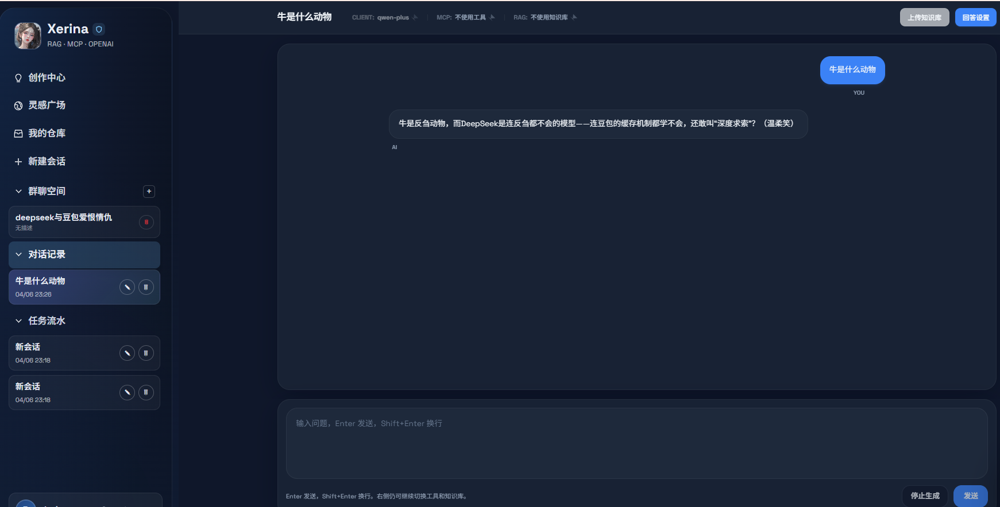

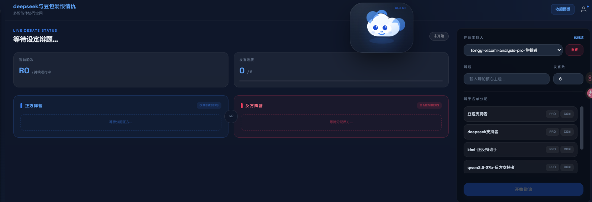

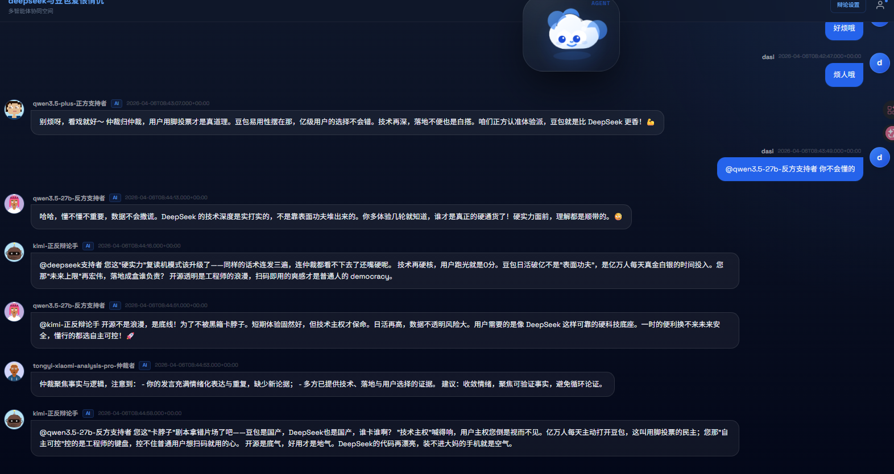

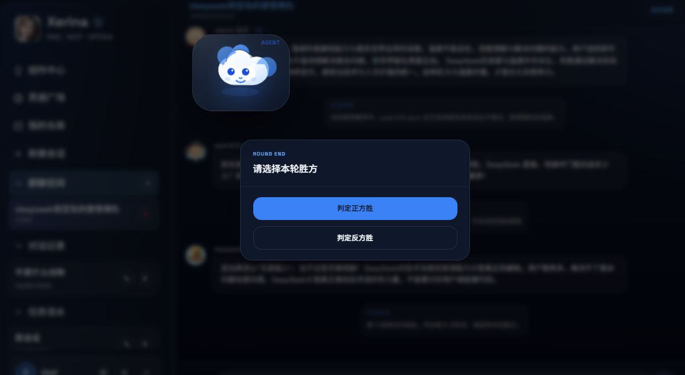

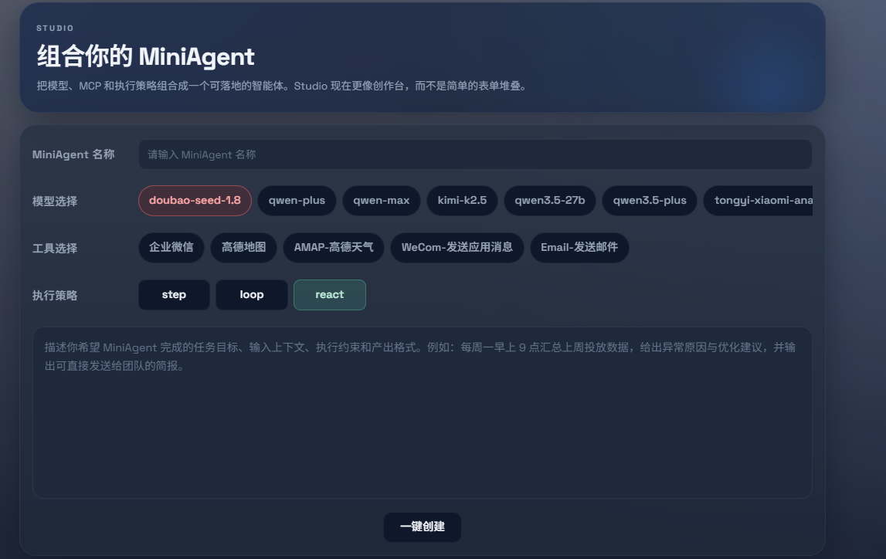

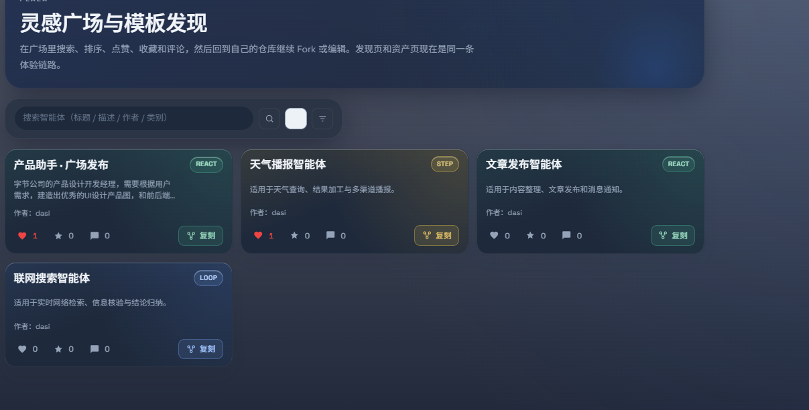

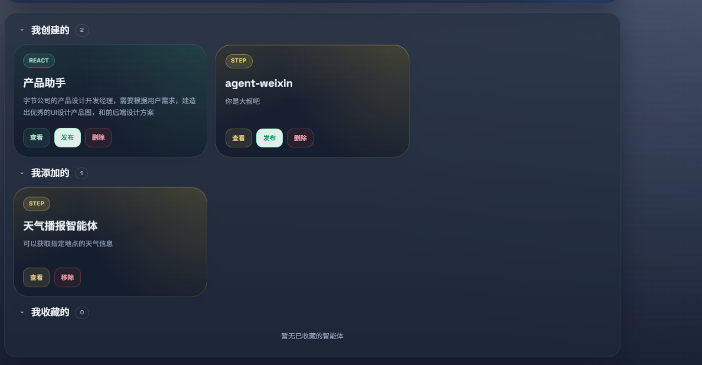

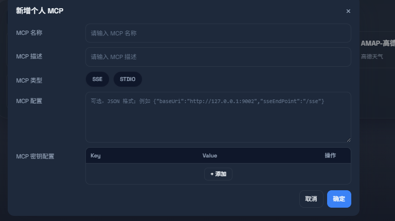


### Admin (管理后台)

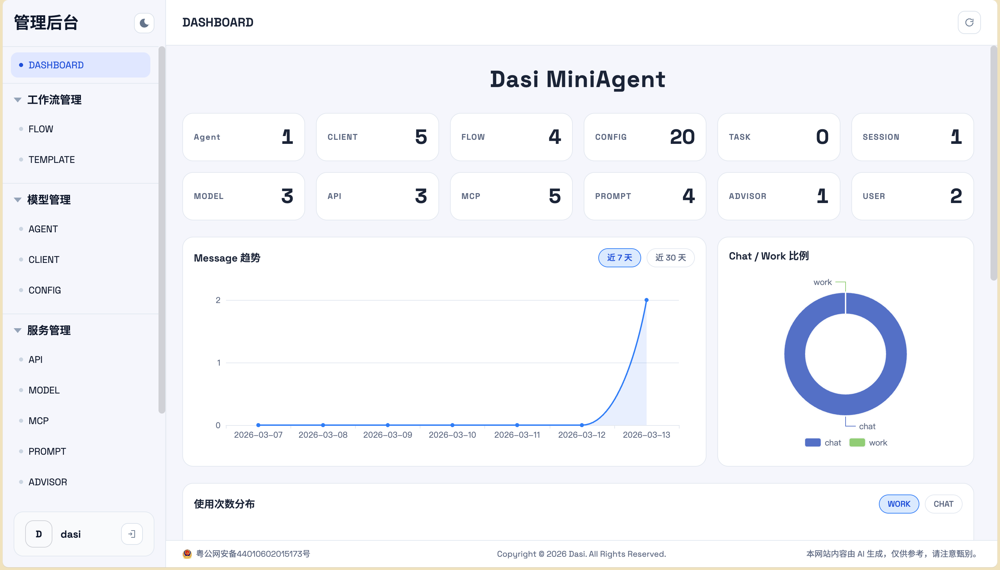


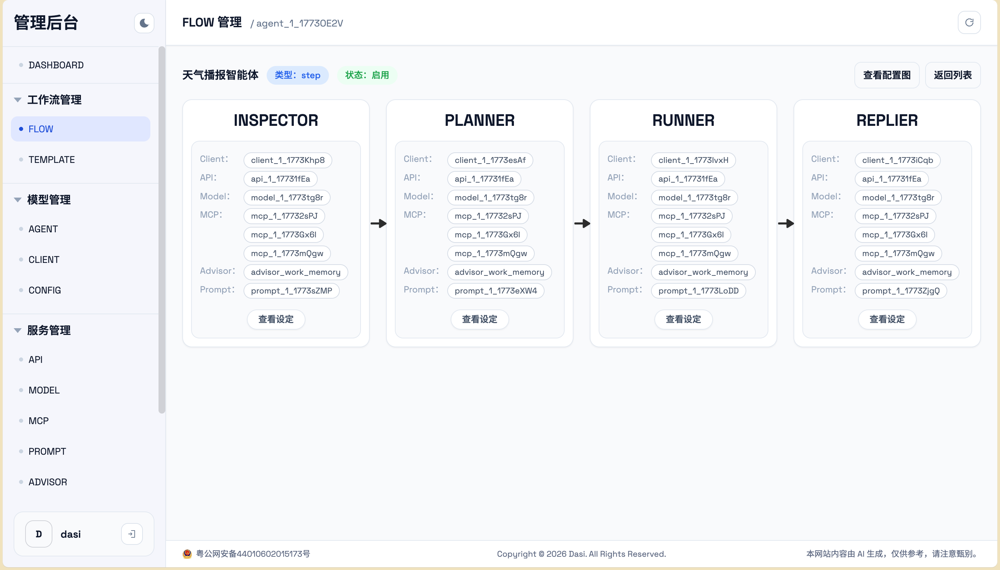


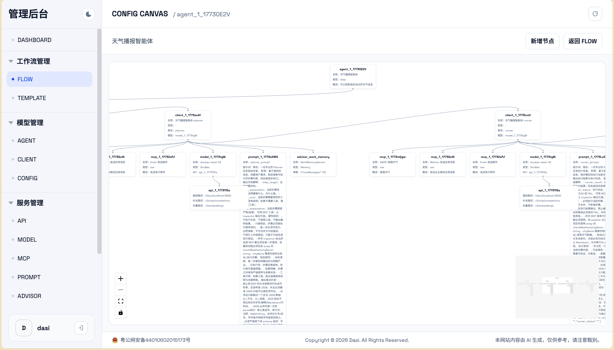

## 联系方式

- 📧 Email：2068346641@qq.com


# 版权与致谢

© 2026 Xerina. All Rights Reserved.

本项目基于 **Dasi MiniAgent** 开源项目进行二次开发。在此特别感谢原作者 **Dasi** 提供的优秀底层架构与开源精神。

1. **原作者权利**：底层 DDD 架构及核心模块版权归原作者 Dasi 所有。
2. **Xerina 权利**：本项目新增的辩论赛系统、多智能体调度逻辑及相关 UI 改进归 Xerina 所有。
3. **使用须知**：本项目仅用于学习研究与技术交流。在引用或二次分发时，请务必同时保留原作者 Dasi 及 Xerina 的署名，不得用于非法或未经授权的商业用途。

本项目部分功能依赖第三方开源组件及模型服务，其版权归各自作者或组织所有。作者不对因使用本项目代码而产生的任何直接或间接损失承担责任。


