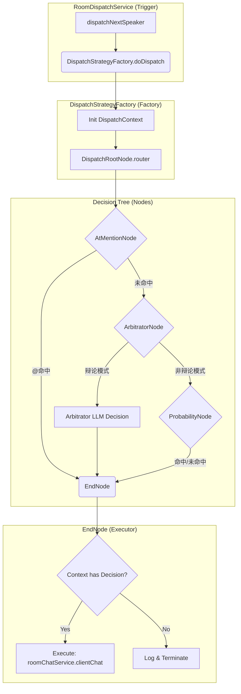

# 仲裁者辩论赛 - 完整实现蓝图 v5 (开发者级文档)

## 一、 核心目标与设计原则
*   **目标**: 重构 `RoomDispatchService` 的调度逻辑，引入基于规则树的智能决策系统，支持“仲裁者”主持的自动辩论赛模式。
*   **双模式支持**: 房间支持“自由聊天”与“仲裁辩论”两种模式。系统实时判断当前模式并采取对应调度策略。
*   **核心组件**:
    *   **规则树**: 采用 `StrategyRouter` 模式，通过节点路由实现优先级决策。
    *   **工厂入口**: `DispatchStrategyFactory` 负责上下文生命周期管理与路由启动。
    *   **仓储收敛**: 在 `IChatRoomRepository` 中追加辩论持久化方法，不另设仓储层。

---

## 二、 数据库表结构设计 (SQL)
在 `docs/mysql/table-struction.sql` 中追加以下 DDL：

```sql
CREATE TABLE ai_debate_session (
  id                   bigint       PRIMARY KEY AUTO_INCREMENT,
  session_id           varchar(64)  NOT NULL COMMENT '辩论会话业务ID (debate_xxx)',
  room_id              varchar(64)  NOT NULL COMMENT '关联房间ID',
  topic                varchar(512) NOT NULL COMMENT '辩论主题',
  arbitrator_client_id varchar(64)  NOT NULL COMMENT '仲裁者 CLIENT ID',
  pro_client_ids       varchar(512) NOT NULL COMMENT '正方ID列表(逗号分隔)',
  con_client_ids       varchar(512) NOT NULL COMMENT '反方ID列表(逗号分隔)',
  turns_per_round      int          NOT NULL DEFAULT 6 COMMENT '每轮对话次数',
  current_round        int          NOT NULL DEFAULT 0,
  current_turn         int          NOT NULL DEFAULT 0,
  round_winners        varchar(255) DEFAULT NULL COMMENT '胜方记录(PRO,CON,...)',
  status               varchar(20)  NOT NULL DEFAULT 'PENDING' COMMENT 'PENDING/RUNNING/ROUND_END/FINISHED',
  version              int          NOT NULL DEFAULT 0,
  create_time          datetime     DEFAULT CURRENT_TIMESTAMP,
  update_time          datetime     DEFAULT CURRENT_TIMESTAMP ON UPDATE CURRENT_TIMESTAMP,
  UNIQUE KEY uk_session_id (session_id),
  INDEX idx_room_status (room_id, status)
) COMMENT='辩论会话表';

CREATE TABLE ai_debate_record (
  id                   bigint       PRIMARY KEY AUTO_INCREMENT,
  record_id            varchar(64)  NOT NULL COMMENT '记录业务ID (dr_xxx)',
  session_id           varchar(64)  NOT NULL COMMENT '关联辩论会话ID',
  round_number         int          NOT NULL,
  turn_number          int          NOT NULL,
  speaker_client_id    varchar(64)  NOT NULL,
  side                 varchar(10)  NOT NULL COMMENT 'PRO/CON',
  message_id           varchar(64)  NULL,
  arbitrator_reasoning varchar(100) NOT NULL COMMENT '仲裁理由(50字内)',
  create_time          datetime     DEFAULT CURRENT_TIMESTAMP,
  UNIQUE KEY uk_record_id (record_id),
  INDEX idx_session_round (session_id, round_number)
) COMMENT='辩论对话记录表';
```

---

## 三、 规则树设计流转图 (Mermaid)



---

## 四、 五阶段详细实现规划

### 阶段 1: 基础设施与持久化增强 (Infrastructure)
*   **PO (Persistent Objects)**:
    *   `AiDebateSession.java`: 对应 `ai_debate_session` 表。
    *   `AiDebateRecord.java`: 对应 `ai_debate_record` 表。
*   **DAO (MyBatis Mapper)**:
    *   `IAiDebateSessionDao.java`: 提供 `insert`, `queryActiveByRoomId`, `updateWithLock`。
    *   `IAiDebateRecordDao.java`: 提供 `insert`, `queryBySessionAndRound`。
*   **Repository (Contract & Implementation)**:
    *   `IChatRoomRepository.java`: 追加辩论方法定义。
    *   `ChatRoomRepository.java`: 实现上述方法，转换 PO 为领域 Entity。

### 阶段 2: 规则树引擎构建 (Rule Tree Engine)
*   **VO (Value Objects)**:
    *   `DispatchRequest.java`: `roomId`, `eventType`, `atMemberIds`, `senderId`。
    *   `DispatchContext.java`: **内部管理**，包含 `DispatchDecision` 和 `DebateSessionEntity` (缓存用)。
*   **Nodes (StrategyRouter Implementation)**:
    *   `AbstractDispatchNode.java`: 继承 `AbstractMultiThreadStrategyRouter`，提供通用工具。
    *   `AtMentionNode.java`: 检查 `@`。命中则设置决策并路由至 `EndNode`。
    *   `ArbitratorNode.java`: **关键节点**。判断 `context.getDebateSession()` 是否存在且活跃。若无，路由至 `ProbabilityNode`。
    *   `ProbabilityNode.java`: 50% 概率响应。路由至 `EndNode`。
    *   `EndNode.java`: **强制汇聚点**。执行 `roomChatService.clientChat`。
*   **Factory**:
    *   `DispatchStrategyFactory.java`: 负责 `context` 初始化并启动 `RootNode`。

### 阶段 3: 辩论领域逻辑实现 (Domain Business)
*   **Entity (Domain Logic)**:
    *   `DebateSessionEntity.java`: 封装业务逻辑，如 `isRoundEnd()`, `advanceTurn()`, `getSideForClient()`。
*   **Service**:
    *   `IDebateService.java` & `DebateService.java`:
        *   `startDebate()`: 校验房间仲裁者，创建 Session。
        *   `recordTurn()`: 记录发言并更新 Session 进度。
        *   `declareWinner()`: 用户 API 触发，标记胜方。

### 阶段 4: 仲裁者 LLM 与 API 接入 (LLM & API)
*   **Prompt 模板**: `resources/prompt/system-prompt/debate-dispatch-template.txt`。
*   **ArbitratorNode LLM 逻辑**:
    *   调用 `debateService.buildPromptContext()` 组装上下文。
    *   解析 LLM 返回的 JSON (speaker, reasoning)。
*   **Controller**:
    *   `ChatRoomController.java`: 新增 `/chat-room/debate/start`, `/stop`, `/winner`, `/status` 接口。

### 阶段 5: 集成验证与鲁棒性 (Verification)
*   **防死循环**: 严格校验 `currentTurn < turnsPerRound`。
*   **降级策略**: LLM 解析失败或超时，`ArbitratorNode` 自动降级为正反方轮替逻辑。
*   **并发控制**: 房间状态 `debate_session_id` 确保单房间单会话。

---

## 五、 文件路径与职责清单 (开发者直达)

| 文件路径 | 职责 |
| :--- | :--- |
| `domain/room/model/entity/DebateSessionEntity.java` | 辩论会话领域对象，含状态机流转逻辑 |
| `domain/room/model/valobj/DispatchContext.java` | 规则树内部上下文，存放决策结果 |
| `domain/room/service/dispatch/DispatchStrategyFactory.java` | 规则树唯一入口，负责路由启动 |
| `domain/room/service/dispatch/node/AtMentionNode.java` | 处理 @ 指定回复优先级节点 |
| `domain/room/service/dispatch/node/ArbitratorNode.java` | 模式判断与仲裁者 LLM 调度节点 |
| `domain/room/service/dispatch/node/EndNode.java` | 决策执行节点，调用 clientChat |
| `domain/room/service/debate/DebateService.java` | 辩论生命周期管理领域服务 |
| `infrastructure/repository/ChatRoomRepository.java` | 辩论数据的持久化与 Entity 转换 |
| `trigger/controller/ChatRoomController.java` | 暴露 REST 接口供用户控制赛程 |
