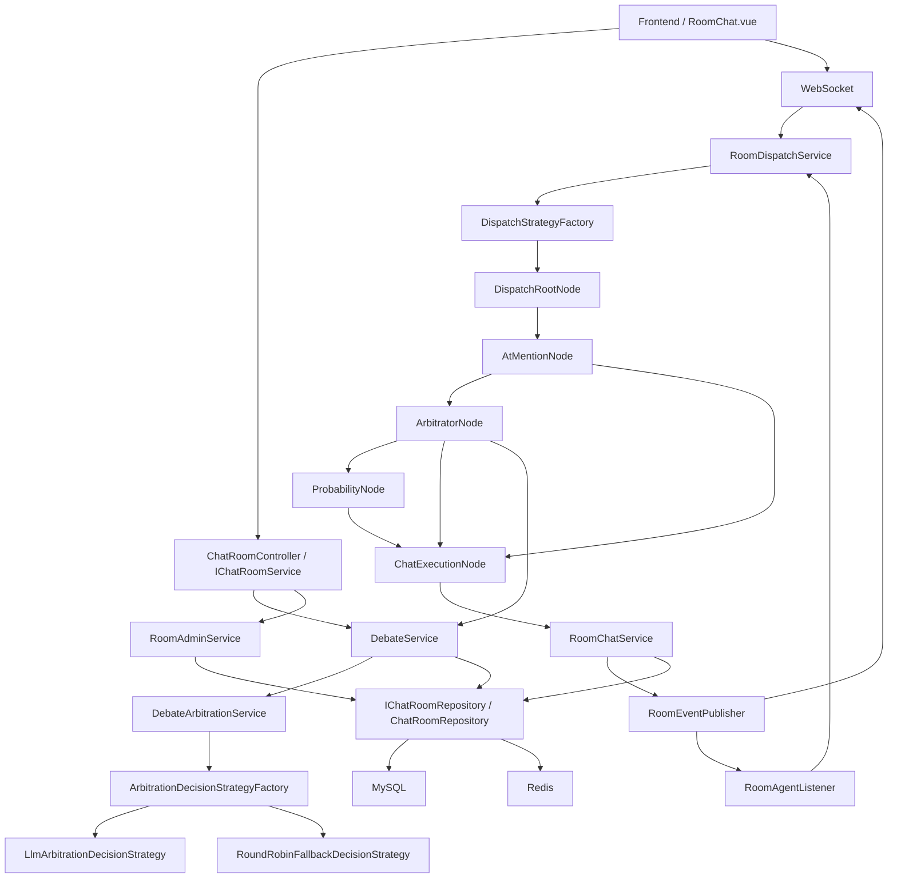
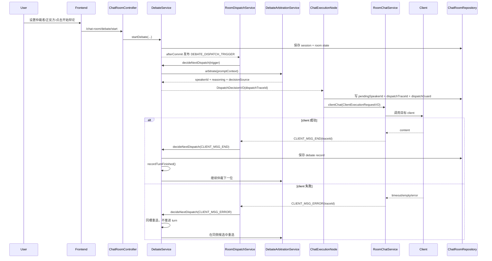
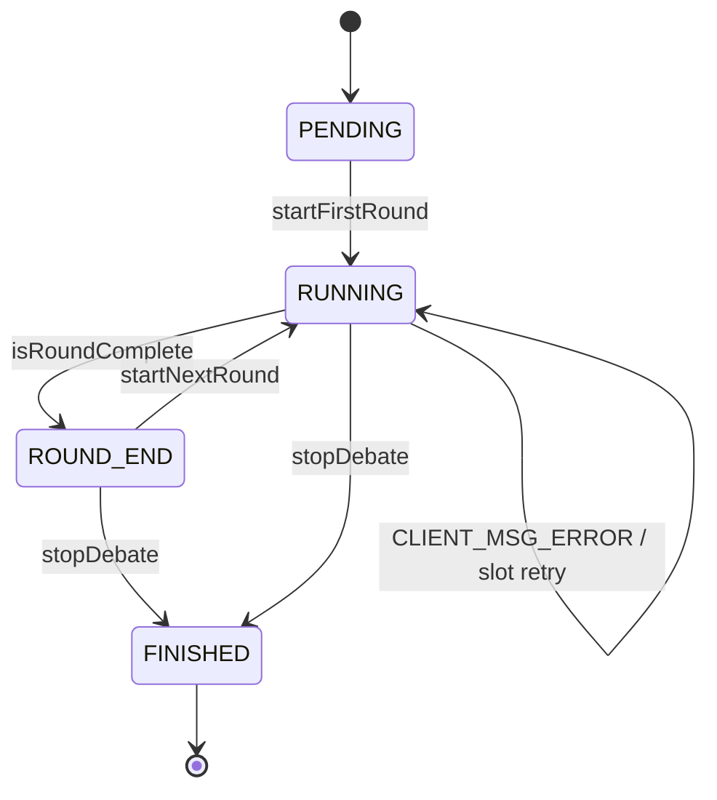
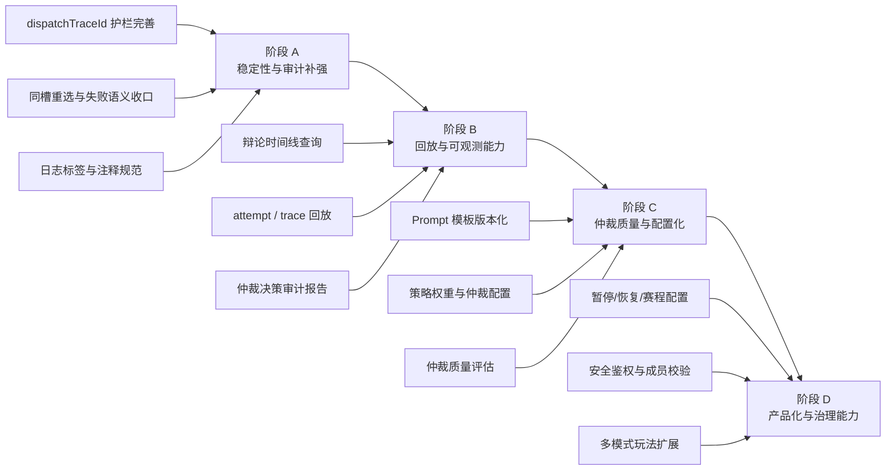

# 仲裁辩论系统总结文档与成长路线图

## 1. 背景与目标

### 1.1 业务背景

当前系统已经具备房间内多成员协作聊天能力，并在此基础上逐步扩展出“仲裁辩论模式”：

- 房间由用户、`CLIENT`、`AGENT` 共同构成
- 普通聊天模式下，房间中的 `CLIENT` 可按概率参与接话
- 辩论模式下，由一个指定的仲裁者 `CLIENT` 决定下一位应发言的辩手
- 用户负责设置仲裁者、指定正反方、启动辩论、宣布每轮胜方

该能力的核心目标不是简单的“多模型群聊”，而是构建一个具备领域状态机、可回放、可扩展、可继续成长的房间辩论系统。

### 1.2 当前阶段目标

当前已经落地并稳定运行的阶段目标如下：

- 用户可设置仲裁者 `clientId`
- 用户可指定正方与反方 `clientId`
- 开始辩论后，首位发言者与后续发言者都通过规则树统一调度
- 仲裁结果只认 `clientId`，不允许按 `clientName` 参与执行判断
- 每轮结束后由用户手动裁决胜方
- 单个 `client` 超时、空响应、执行失败时，不允许卡死整轮辩论
- 停止辩论后，旧执行和旧回调必须被彻底切断，防止幽灵执行

### 1.3 当前阶段边界

当前实现明确保留以下边界：

- 暂不处理 WebSocket 身份鉴权
- 暂不处理房间成员安全校验
- 暂不将所有运行态字段结构化入库
- 暂不支持自动判胜
- 暂不支持自动分组
- 暂不支持暂停/恢复辩论

## 2. 代码结构总览

系统整体采用 DDD 分层，但当前工程结构并未单独拆出 application 层，因此 `domain/room/service` 同时承担领域服务与部分应用编排职责。

### 2.1 模块分层

#### `ai-agent-api`

对外 REST 合同定义层，负责接口声明与请求/响应 DTO。

当前与仲裁辩论最相关的接口定义在：

- `com.dasi.api.IChatRoomService`
- `dto/request/*`
- `dto/response/*`

#### `ai-agent-trigger`

触发器层，负责：

- REST 控制器
- WebSocket 入口
- 内部消息监听器

当前关键入口包括：

- `ChatRoomController`
- `ChatRoomSocketHandler`
- `RoomAgentListener`

#### `ai-agent-domain`

房间领域核心实现所在，承担：

- 房间与成员管理
- 聊天调度
- 辩论状态机
- 仲裁上下文装配
- 仲裁策略与执行链

当前 `domain/room` 下的主要子结构如下：

- `apapter/port`
- `apapter/repository`
- `model/entity`
- `model/valobj`
- `service/chat`
- `service/dispatch`
- `service/debate`
- `service/room`

#### `ai-agent-infrastructure`

基础设施层，负责：

- MyBatis DAO / Mapper
- `ChatRoomRepository`
- Redis 缓存
- WebSocket 事件发布器

#### `frontend`

前端房间聊天页与辩论面板实现，当前主要承载：

- 房间消息流
- 辩论面板
- 胜方裁决弹窗
- 系统通知展示

### 2.2 仓储策略

当前 `room` 大领域继续坚持单仓储：

- 领域仓储接口：`IChatRoomRepository`
- 基础设施实现：`ChatRoomRepository`

虽然内部涉及房间、成员、消息、房态、辩论 session、辩论 record 等多类数据，但都统一归于 `room` 大领域仓储，不拆分成多个独立 repository。

该策略当前成立的前提是：

- 方法按“查询意图”划分，而不是按表拼接大查询
- 高并发链路查询只取必要字段
- 运行态优先落在 `ai_chat_room_state.public_data`

## 3. 当前已实现功能清单

## 3.1 房间基础能力

当前已实现：

- 创建聊天室
- 删除聊天室
- 查询用户参与的房间列表
- 添加/移除房间成员
- 查询房间成员列表
- 游标分页查询房间消息
- WebSocket 房间消息广播

## 3.2 普通聊天能力

当前已实现：

- 用户发言持久化
- `CLIENT` 基于概率参与接话
- `@` 指定优先命中房间内合法 `CLIENT`
- 被 `@` 时优先插队响应

## 3.3 仲裁辩论能力

当前已实现：

- 设置仲裁者
- 移除仲裁者
- 指定正方成员与反方成员
- 开始辩论
- 仲裁者决定首发
- 仲裁者决定后续 speaker
- `ROUND_END` 轮次结束
- 用户宣布本轮胜方
- 开启下一轮
- 停止辩论
- 查询当前辩论状态

## 3.4 稳定性与续跑能力

当前已实现：

- `dispatchTraceId` 执行因果令牌
- stale callback 丢弃
- `CLIENT_MSG_ERROR` 失败续跑
- 同槽重选
- `SLOT_SKIPPED`
- Redis 脏缓存回源恢复
- 失败不直接吞 turn

## 3.5 前端辩论能力

当前已实现：

- 辩论面板
- 仲裁者选择
- 正反方选择
- 辩题与每轮发言数配置
- 胜方裁决弹窗
- 面板手动收起
- 系统通知弱化展示
- 辩论状态恢复

## 4. 核心领域模型

## 4.1 核心实体

### `DebateSessionEntity`

职责：

- 表达一场辩论会话的当前业务状态
- 管理轮次推进
- 管理 session 状态机
- 生成候选 speaker 集合
- 生成优先候选顺序
- 校验仲裁结果是否合法

当前关键字段：

- `sessionId`
- `roomId`
- `topic`
- `arbitratorClientId`
- `proClientIds`
- `conClientIds`
- `turnsPerRound`
- `currentRound`
- `currentTurn`
- `roundWinners`
- `status`
- `version`

### `DebateRecordEntity`

职责：

- 记录一次成功完成的辩手发言
- 关联轮次、turn、speaker、messageId、调度说明

当前关键字段：

- `recordId`
- `sessionId`
- `roomId`
- `roundNumber`
- `turnNumber`
- `speakerClientId`
- `speakerName`
- `side`
- `messageId`
- `arbitratorReasoning`

### `DispatchStrategyEntity`

职责：

- 作为规则树输入对象
- 封装本次调度的 room / event / sender / atMemberIds / currentMessage / traceId

### `AiChatRoomMessageEntity`

职责：

- 统一抽象用户消息、辩手消息、系统通知消息
- `extData` 承载结构化扩展信息

## 4.2 核心值对象

### `DispatchDecisionVO`

职责：

- 表示调度结果
- 包含最终 speaker、来源、reasoning、session 护栏和 `dispatchTraceId`

当前关键字段：

- `speakerId`
- `decisionSource`
- `reasoning`
- `sessionId`
- `roundNumber`
- `sessionVersion`
- `dispatchTraceId`
- `requiredSide`

### `RoomDebateStateVO`

职责：

- 房间级运行态
- 用于跨异步链路保存当前活跃 session、pending speaker、调度护栏、slot 重选信息

当前关键字段：

- `arbitratorClientId`
- `activeDebateSessionId`
- `pendingSpeakerId`
- `pendingTurnNumber`
- `pendingDecisionSource`
- `pendingDecisionReasoning`
- `dispatchSessionId`
- `dispatchRound`
- `dispatchVersion`
- `dispatchTraceId`
- `slotRequiredSide`
- `slotAttemptedSpeakerIds`
- `slotRetryCount`
- `pendingRoundNumber`
- `pendingRoundTurnCount`
- `lastRoundEndedAt`
- `lastRoundSummary`
- `version`

### `ArbitrationPromptContextVO`

职责：

- 装配仲裁者 Prompt 所需上下文
- 明确候选、优先级、上一位 speaker、轮内统计、历史与最近消息

当前关键字段：

- `roomId`
- `sessionId`
- `topic`
- `arbitratorClientId`
- `currentRound`
- `currentTurn`
- `turnsPerRound`
- `lastSpeakerClientId`
- `lastSpeakerName`
- `candidateSpeakerIds`
- `preferredSpeakerIds`
- `candidateJoinOrder`
- `lastSpeakerSide`
- `speakerHistoryStats`
- `requiredSide`
- `excludedSpeakerIds`
- `slotRetryCount`
- `proMembers`
- `conMembers`
- `roundHistory`
- `recentConversation`

### `ClientExecutionRequestVO`

职责：

- 绑定一次真实 client 执行与其所属的 session / round / version / trace
- 防止旧回调污染新辩论

当前关键字段：

- `roomId`
- `clientId`
- `sessionId`
- `roundNumber`
- `sessionVersion`
- `dispatchTraceId`
- `decisionSource`
- `reasoning`

## 4.3 核心不变量

当前系统必须满足以下不变量：

1. `clientId` 是唯一身份标识
2. 只有成功的 `CLIENT_MSG_END` 才消耗 turn
3. `CLIENT_MSG_ERROR` 必须先进入同槽重选
4. `ChatExecutionNode` 是唯一允许执行 `clientChat(...)` 的入口
5. 所有辩论回调都必须带 `dispatchTraceId`
6. 任一 stale callback 都必须被丢弃，不允许写库和续跑

## 5. 系统架构设计

## 5.1 总体架构图

## 5.2 设计说明

当前架构遵循以下原则：

- 用户侧入口统一从 REST / WebSocket 进入
- 调度逻辑统一进入规则树
- 辩论决策统一收口到 `DebateService`
- 仲裁者决策统一收口到 `DebateArbitrationService`
- `ChatExecutionNode` 负责把“决策”转为“真实执行”
- `RoomChatService` 负责消息持久化和内部/外部事件派发
- `IChatRoomRepository` 统一承接 room 大领域的数据访问

## 6. 辩论执行流程设计

## 6.1 标准执行时序图

## 6.2 关键流程说明

### 开始辩论

- 用户通过 `/chat-room/debate/start` 提交辩题、正方、反方、每轮发言数
- `DebateService` 创建 session 并初始化房间运行态
- after-commit 发布 `DEBATE_DISPATCH_TRIGGER`
- 规则树进入仲裁节点
- 仲裁者决定第一位发言者

### 成功发言

- `ChatExecutionNode` 写入 pending state 与调度护栏
- `RoomChatService` 执行 client
- 成功后发布 `CLIENT_MSG_END`
- `DebateService` 记录 `DebateRecordEntity`
- `recordTurnFinished()`
- 若未结束则继续仲裁下一位

### 发言失败

- `RoomChatService` 发布 `CLIENT_MSG_ERROR`
- `DebateService` 不推进 turn
- 失败 speaker 进入 `slotAttemptedSpeakerIds`
- 固定要求仲裁者在同一方中重新补位
- 若同侧候选耗尽，则发布 `SLOT_SKIPPED` 并跳过该槽位

### 停止辩论

- `stopDebate()` 清空 `activeDebateSessionId`
- 清空 `pendingSpeakerId`
- 清空 `dispatchTraceId`
- 清空 slot 运行态
- 旧回调再回来时，由护栏校验直接丢弃

## 7. 状态机与运行态设计

## 7.1 辩论 session 状态机

## 7.2 slot / turn 区别

当前系统必须区分：

- `slot`
  - 当前正在处理的逻辑发言位
  - 可以出现多次失败重选
- `turn`
  - 只有成功发言后才加 1
  - 用于判断是否到达 `turnsPerRound`

### 当前规则

- 成功发言：
  - 完成当前 slot
  - `turn + 1`
- 失败发言：
  - 不完成 turn
  - 进入同槽重选
- 同侧候选耗尽：
  - 发布 `SLOT_SKIPPED`
  - 该槽显式结束
  - 然后继续下一次攻防

## 7.3 幽灵执行防护

防护依赖以下字段联合作为护栏：

- `activeDebateSessionId`
- `pendingSpeakerId`
- `dispatchSessionId`
- `dispatchRound`
- `dispatchVersion`
- `dispatchTraceId`

处理回调时，任何一项不匹配都按 stale callback 丢弃。

## 8. 数据库与缓存策略

## 8.1 当前数据库策略

当前实现**无必须新增表结构**，原因如下：

- `dispatchTraceId`、`slotRetryCount`、`slotRequiredSide` 等都属于房间运行态
- 当前优先写入 `ai_chat_room_state.public_data`
- 执行回调的 trace 信息优先写入 `ai_chat_room_message.ext_data`

### 当前保留核心表

- `ai_chat_room_state`
- `ai_chat_room_message`
- `ai_debate_session`
- `ai_debate_record`

## 8.2 当前缓存策略

- `queryActiveDebateSession(roomId)`
  - 优先走 Redis
  - 反序列化失败删除坏缓存
  - 回源 MySQL 重建
- `RoomDebateStateVO`
  - 写回 MySQL 后清理 Redis
  - 再按读取路径重建缓存

## 8.3 可选增强版结构化演进方向

当前不强制改库，但下一阶段若需要增强审计与回放，可考虑：

### 方案一：增强 `ai_debate_record`

可选新增字段：

- `dispatch_trace_id`
- `decision_source`
- `failure_type`

适合：

- 已有辩论记录模型上叠加可观测能力

### 方案二：新增 `ai_debate_attempt_log`

可选字段：

- `attempt_id`
- `session_id`
- `room_id`
- `round_number`
- `slot_number`
- `speaker_id`
- `dispatch_trace_id`
- `decision_source`
- `failure_type`
- `status`
- `create_time`

适合：

- 需要完整回放失败尝试和补位过程

当前默认策略：

- 继续采用“结构化主表 + JSON 运行态”
- 不立即引入新表

## 9. 当前已知缺口与下一步执行方向

当前主链已基本可用，但仍处于“稳定运行能力逐步成长”的阶段。建议后续不要继续堆补丁，而是按阶段演进。

### 阶段 A：稳定性与审计补强

目标：

- 将当前辩论链路打磨成稳定主链
- 统一日志、trace、slot/turn 语义

建议动作：

- 统一所有成功/失败回调都带 `dispatchTraceId`
- 统一日志标签与日志字段
- 补齐 `SLOT_RETRY`、`SLOT_SKIPPED` 的前端提示
- 补齐异常场景回放脚本

对外 API：

- 保持不变

验收：

- 停止辩论后旧回调不会污染新辩论
- 失败不会吞掉 turn
- 首发、续发、失败、跳过都能完整复盘

### 阶段 B：回放与可观测能力

目标：

- 让研发与业务能完整回放一场辩论

推荐新增接口：

- `GET /chat-room/debate/timeline`
- `GET /chat-room/debate/attempts`
- `GET /chat-room/debate/report`

推荐动作：

- 增加辩论时间线查询
- 增加 slot attempt 查询
- 增加一场辩论的结构化报告
- 评估是否将 trace / failure type 结构化入库

验收：

- 可以按 session 查询完整时间线
- 可以定位某次 speaker 失败的 trace 与原因

### 阶段 C：仲裁质量与配置化

目标：

- 让仲裁者选择更接近真实攻防

推荐新增能力：

- Prompt 模板版本化
- 仲裁策略配置
- 房间级辩论风格配置
- 仲裁质量评估

推荐新增接口：

- `GET /chat-room/debate/config`
- `POST /chat-room/debate/config/save`
- `GET /chat-room/debate/prompt/preview`

验收：

- 同主题房间可配置不同仲裁风格
- Prompt 升级不影响历史回放

### 阶段 D：产品化与治理能力

目标：

- 从“可运行”升级为“可产品化”

推荐新增功能：

- 暂停辩论
- 恢复辩论
- 多轮赛程配置
- 房间成员鉴权
- 辩论总结导出

推荐新增接口：

- `POST /chat-room/debate/pause`
- `POST /chat-room/debate/resume`
- `GET /chat-room/debate/export`

验收：

- 用户能暂停/恢复 session
- 安全边界清晰
- 一场辩论可以输出结构化结果

## 10. 阶段性路线图

## 11. 接口现状与下一步规划

## 11.1 当前已实现对外接口

- `/chat-room/arbitrator/set`
- `/chat-room/arbitrator/remove`
- `/chat-room/debate/start`
- `/chat-room/debate/round/winner`
- `/chat-room/debate/round/next`
- `/chat-room/debate/stop`
- `/chat-room/debate/status`

## 11.2 下一阶段推荐新增接口

- `GET /chat-room/debate/timeline`
- `GET /chat-room/debate/attempts`
- `GET /chat-room/debate/report`
- `GET /chat-room/debate/config`
- `POST /chat-room/debate/config/save`
- `POST /chat-room/debate/pause`
- `POST /chat-room/debate/resume`
- `GET /chat-room/debate/export`

说明：

- 上述接口属于下一阶段规划态
- 当前不要求立即实现
- 文档中保留这些接口，是为了约束后续演进方向

## 12. 测试与验收标准

## 12.1 基础链路

- 开始辩论后首位 speaker 能自动发言
- 每位 speaker 成功后会继续下一位
- `ROUND_END` 后用户可裁决胜方
- 下一轮可以继续开启

## 12.2 稳定性

- 旧回调不会污染新 session
- 停止辩论后不会继续调度
- stale callback 会被直接丢弃

## 12.3 公平性

- `CLIENT_MSG_ERROR` 不直接吞掉 turn
- 同槽失败后会同方补位
- 同侧候选耗尽后会显式 `SLOT_SKIPPED`

## 12.4 前端

- 面板可收起
- `ROUND_END` 裁决弹窗可恢复
- 系统通知弱化，不遮挡主辩论流

## 12.5 工程

- 后端编译通过
- 前端构建通过
- 文档、代码、接口合同一致

## 13. 当前默认约束

- 默认新增新文档，而不是覆盖现有实现计划文档
- 当前数据库继续采用“结构化主表 + JSON 运行态”的组合
- 下一阶段优先顺序默认是：
  1. 稳定性与审计
  2. 回放与可观测
  3. 仲裁质量与配置化
  4. 产品化与治理
- 当前不把 WebSocket 鉴权作为下一步第一优先级
- 当前每轮胜方继续由用户手动裁决

